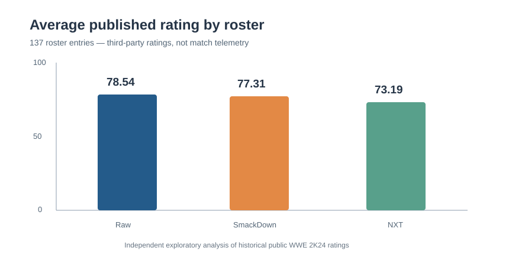

# WWE 2K24 — Superstar Ratings & Roster Balance Analytics

**Independent game-science portfolio project** | Python · Pandas · NumPy · Matplotlib · Data validation · Data storytelling

> **Important:** This is an exploratory analysis of **137 publicly published WWE 2K24 roster entries** across Raw, SmackDown and NXT. These are character ratings, **not** 2K internal gameplay telemetry, actual win rates, player engagement, retention, churn or evidence of gameplay fairness. Not affiliated with or endorsed by WWE or 2K.



## Executive summary

| KPI | Result |
|---|---|
| Published roster entries | **137** |
| Unique superstar names | **136** |
| Roster sizes | Raw **56** · SmackDown **49** · NXT **32** |
| Average published rating | Raw **78.54** · SmackDown **77.31** · NXT **73.19** |
| Entries rated 85+ | Raw **23.21%** · SmackDown **28.57%** · NXT **0%** |
| Highest / lowest observed | Roman Reigns **97** · SCRYPTS **61** |
| Missing data or repeated same-roster keys | **0** |

**Takeaway:** The published NXT rating distribution is lower and narrower in this sample. SmackDown's share of entries rated 85+ is slightly above Raw's despite similar means. These descriptive findings do not prove real match outcomes or balance.

## Research question

How do in-game overall ratings vary across WWE 2K24 rosters, and what additional player-behaviour measurements would a games insights team need to evaluate character balance?

## Repository structure

```text
data/wwe2k24_ratings.csv          # 137 rows of third-party published ratings
src/analyze.py                    # data QA, descriptive statistics, 4 charts, result exports
tests/test_analysis.py           # five repeatable data/analysis tests
docs/ANALYSIS.md                 # end-to-end methodology and interpretation
results/roster_summary.csv       # key summary KPIs
results/rating_bands.csv         # rating distributions
results/cross_roster_names.csv   # cross-roster repeated names
requirements.txt                 # dependencies
```

The analysis script also generates `results/all_entries_ranked.csv` and four PNG charts under `figures/`. Those generated artifacts are reproducible, not source inputs.

## Run locally

```bash
git clone https://github.com/laxmanprasadsomaraju/wwe-2k24-roster-analytics.git
cd wwe-2k24-roster-analytics
python -m pip install -r requirements.txt
python -m src.analyze
python -m unittest discover -s tests -v
```

## Data preparation and QA

- Explicitly validate schema: `brand`, `superstar`, `overall_rating`.
- Require known roster, a nonblank name, whole-number ratings from 0 through 100 and nonmissing values.
- Check for duplicate `(brand, superstar)` records rather than assuming a wrestler can appear only once.
- Preserve the published double appearance of **Jinder Mahal** under Raw and NXT.
- Describe and disclose any source spelling inconsistencies rather than silently inventing corrected identities.

## Exploratory analytics

The Python workflow calculates roster-level count, mean, median, standard deviation, quartiles, interquartile range, minimum, maximum and 85+/90+ shares. It generates: a mean-rating bar chart, grouped rating histograms, a stacked rating-band chart and rating-spread boxplots. See [the detailed analysis report](docs/ANALYSIS.md) for interpretations and limitations.

## Game science and potential next steps

To assess real game balance, a team would need privacy-appropriate match telemetry: character selected, skill/matchmaking, mode, opponent, patch version, outcome, player return behaviour and exposure. An observational comparison should adjust for skill and character selection; a controlled experiment could test tuning changes using engagement and fairness guardrails. **No such real-world experiment was conducted in this project.**

## Data provenance and licensing boundaries

These figures were manually transcribed from the historical Raw, SmackDown and NXT tables reported by [Dot Esports](https://dotesports.com/wwe/news/wwe-2k24-complete-roster-and-ratings), with a cross-reference to [The SmackDown Hotel](https://www.thesmackdownhotel.com/news/wwe2k24/wwe-2k24-overall-ratings-list-all-superstars-ranked-by-best-rating). They form a **limited published subset**, not a complete official WWE 2K24 database. Source spelling/classification may be imperfect. Validate independently before using for production decisions.

## Author

**Laxman Prasad Somaraju** — independent sports-game analytics portfolio.